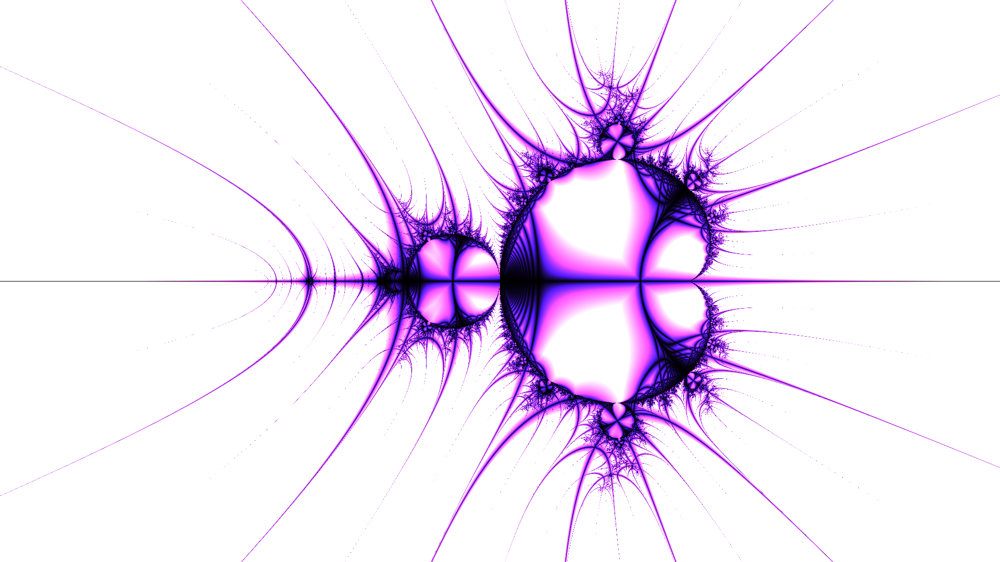

# Stalks plugin for Julia

[Julia](https://github.com/mbilotta/julia) plugin that provide the [orbit trap](https://www.mi.sanu.ac.rs/vismath/javier/b7.htm) representation known as _Stalks_ or _Epsilon cross_. This method was popularized by researcher [Clifford A. Pickover](https://en.wikipedia.org/wiki/Clifford_A._Pickover) at the end of the 80s.

## Installation

1. Download the [latest release](https://github.com/mbilotta/stalks-plugin/releases/latest) (the file named `stalks.jup`).
2. Open _File_ → _Install new plugins..._ in the main UI.
3. Locate file `stalks.jup`.
4. Click _Install_.
5. Restart Julia.

## Building Stalks plugin

You can basically follow the [same steps needed to build DPC4J](https://github.com/mbilotta/dpc4j#building-dpc4j).

## Acknowledgements

Thanks to [JPBotelho](https://github.com/JPBotelho) for providing a sample implementation in his [Fractal-Megacollection](https://github.com/JPBotelho/Fractal-Megacollection).

## Licensing information

Stalks plugin for Julia is provided under the terms of the GNU General Public License (GPL), ver. 3. Once you’ve installed the package, look at file `~/.juliafg/doc/org/altervista/mbilotta/stalks/COPYING` for full license terms.

This program is distributed in the hope that will be useful, but WITHOUT ANY WARRANTY; without even the implied warranty of MERCHANTABILIY or FITNESS FOR A PARTICULAR PURPOSE. For more details, refer to the specific license.